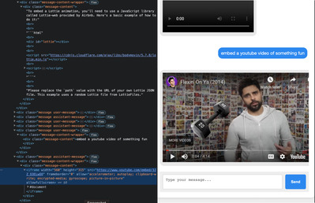
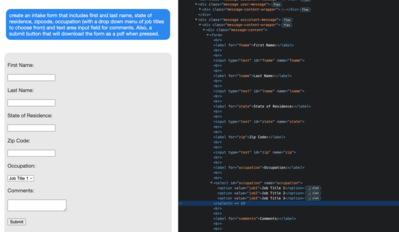
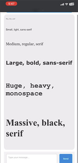

# gpt-ios-messages

chat with gpt within a mobile friendly web-based iOS messages like interface.

 

The neat thing about this concept is that gpt can directly generate user interface elements when asked.

 

For example, you can ask for gpt to embed a video and it will directly embed the video, playable directly within the context of the message.

 

 

Or create a form, or some other javascript/css/html code.

 

 

or generate different font-sizes, types, weights, images...

 

---
